# Vivibit AI 小助手用户使用指南

本文面向普通使用者，说明如何创建知识库、配置模型和解析能力、上传文档、重新解析、下载文档，以及在对话中使用知识库引用。部署、并发和模型资源配置属于管理员工作，见 [部署说明](README.md)、[部署模板说明](deploy-template/README.md) 和 [并发配置说明](deploy-template/CONCURRENCY.md)。

## 1. 新建知识库

进入「知识库」页面，点击标题右侧的绿色文件夹按钮创建知识库。

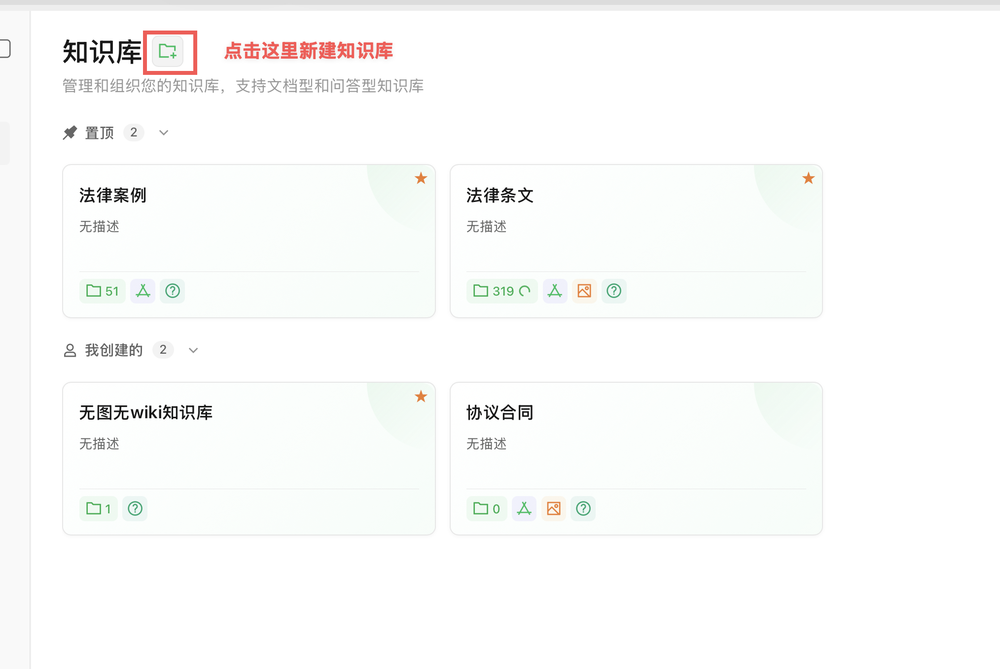

创建时先选「文档」类型，再按左侧配置项依次检查。模型配置、向量存储、解析引擎通常已经由管理员预置；图像处理、Wiki 知识库、知识图谱可以按资料用途开启或关闭。建议在创建阶段就想清楚这些开关，避免上传大量文档后再反复中断和重跑后台任务。

操作顺序：

1. 点击「新建知识库」。
2. 选择「文档」类型。
3. 填写知识库名称和描述。
4. 检查「模型配置」「向量存储」「解析引擎」是否已有默认值。
5. 如果需要自动生成 Wiki 页面，勾选「Wiki 知识库」。
6. 如果有扫描件或图片 PDF，进入「图像处理」开启多模态功能并选择 VLM 模型。
7. 如果需要实体关系分析，进入「知识图谱」开启实体关系提取。
8. 点击「创建知识库」。

建议按资料类型拆分知识库，例如「产品资料」「项目文档」「会议记录」。不同知识库可以分别配置是否启用图像识别、Wiki 和知识图谱。

## 2. 基本信息

新建或编辑知识库时，先填写「知识库名称」和「知识库描述」。左侧配置页用于切换不同能力的设置；红框里的模型、向量存储、解析引擎、图像处理、知识图谱都需要按知识库用途确认。

基本信息页下方的图标表示当前知识库启用的能力：

- 文件夹：文档数量。
- 图谱：实体关系抽取已启用。
- 图片：多模态图像识别已启用。
- 问号：问答知识库能力。
- Wiki 勾选项：开启后会在文档解析后自动生成 Wiki 页面。

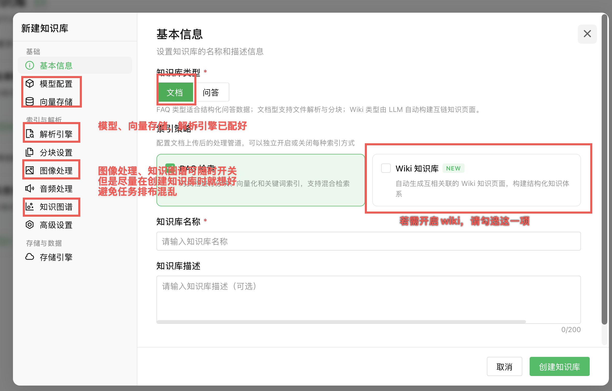

保存配置后，知识库卡片会显示对应能力图标。若图标没有出现，返回设置检查对应功能是否已启用。

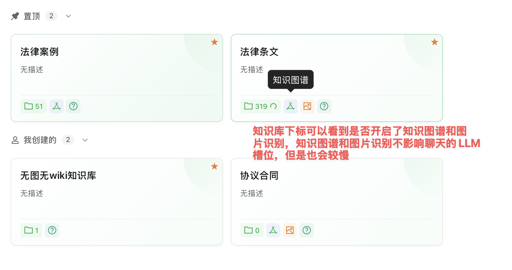

## 3. 模型配置

进入「模型配置」，选择当前知识库使用的默认 LLM 模型。问答、摘要、Wiki、图谱抽取等后台任务通常都会使用这里配置的主模型。

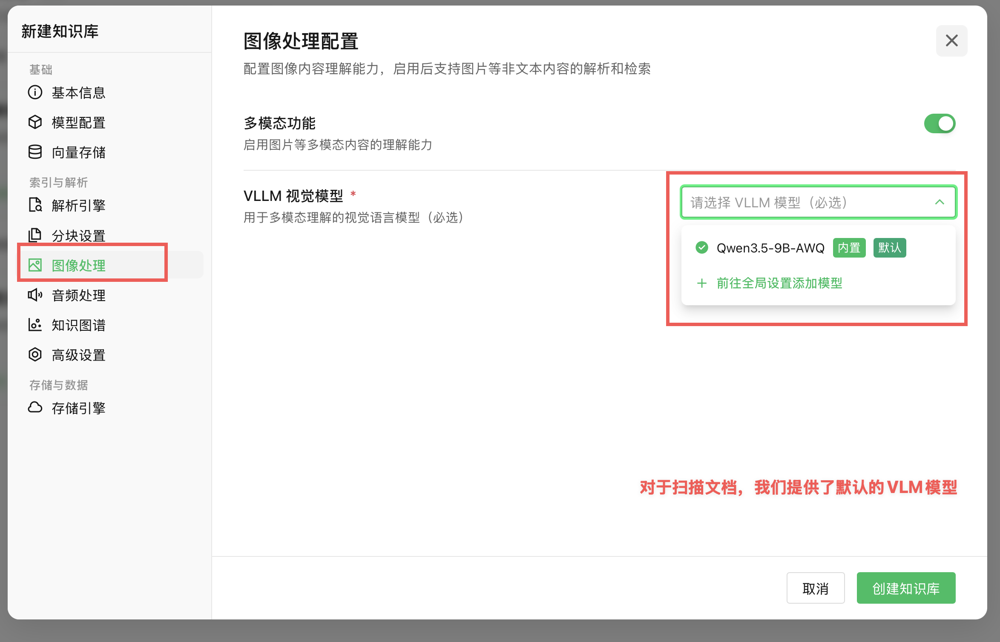

操作方法：点击模型下拉框，选择带「内置」「默认」标识的模型；如果列表为空或没有可用模型，点击「前往全局设置添加模型」让管理员先添加。保存知识库前必须保证默认模型已选好，否则后续问答和后台生成任务都会缺少模型。

使用建议：

- 普通知识库选择管理员配置好的默认模型。
- 如果有多个模型，优先选择带「默认」或「内置」标识的模型。
- 不要随意选择外部不可达模型，否则上传文档后的摘要、Wiki 或图谱任务可能失败。
- 扫描文档还需要在「图像处理」里配置 VLM 视觉模型，LLM 模型不能替代 VLM。

## 4. 知识图谱配置

进入「知识图谱」配置，可控制是否启用实体关系抽取。右上角开关打开后，新上传文档会在文字解析完成后继续抽取实体和关系；关闭后，新上传文档不会生成知识图谱。

关系类型和示例文本用于指导模型抽取哪些实体、关系。页面上方可以维护关系类型标签，页面下方可以维护实体之间的管理关系。需要自定义模板时有两种方式：

- 手动添加：滚动到「管理关系」，点击「添加关系」，逐条选择「实体 A -> 关系 -> 实体 B」。
- 模板覆盖：点击「下载当前模板」，按模板格式修改后，再点击「上传模板」覆盖当前配置。

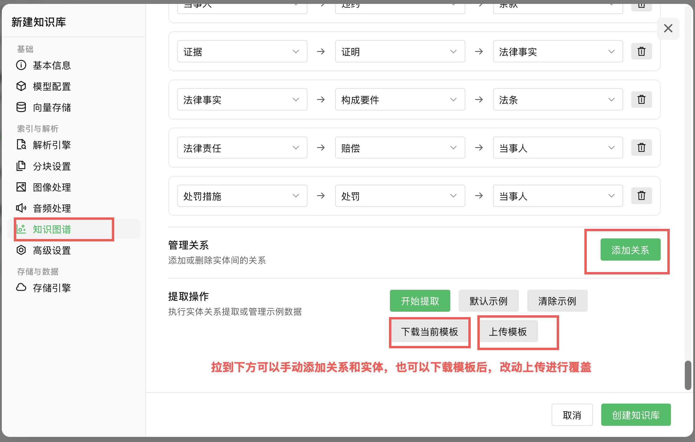

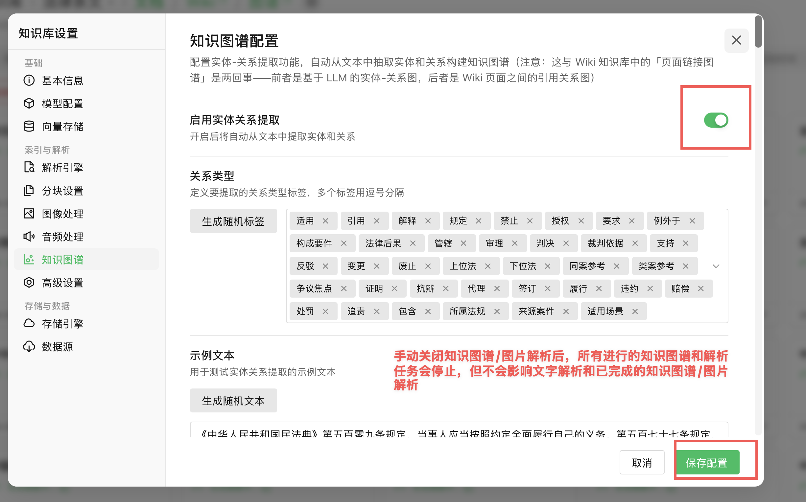

使用建议：

- 文档中实体、概念和关系较多的知识库可以启用知识图谱。
- 只想做全文检索和问答的知识库可以关闭知识图谱，节省解析时间。
- 手动关闭知识图谱并保存后，正在进行或未开始的图谱任务会停止；已经抽取完成的图谱结果会保留。
- 修改关系类型或模板后，已完成的旧文档不会自动重跑；需要对相关文档执行「重建知识」。

文档完成图谱抽取后，进入知识库顶部「图谱」页查看关系图。可以搜索 Wiki 页面或节点，点击节点查看右侧详情；「展开邻居」会以当前节点为中心继续展开关系。图谱里不同颜色代表摘要、实体、概念、综合、对比等节点类型。

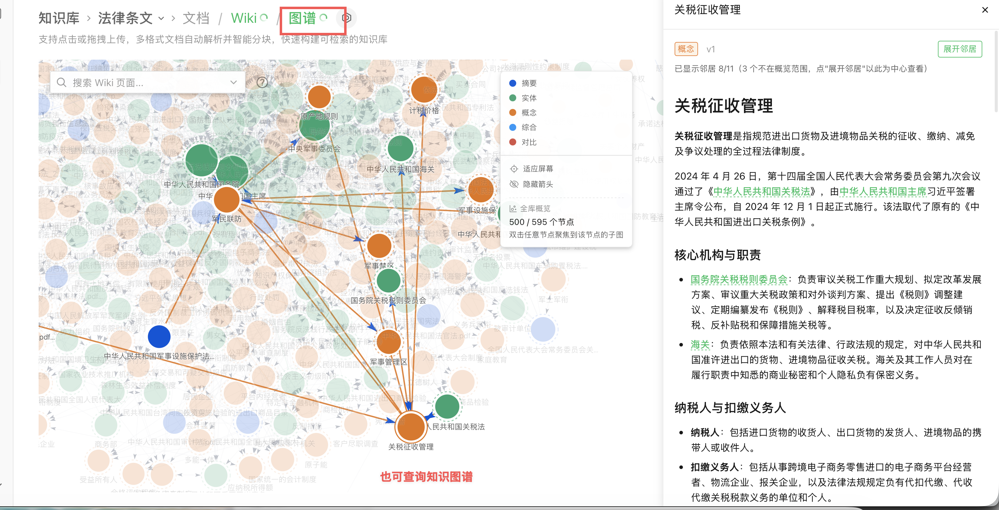

## 5. Wiki 配置

创建知识库时，如果需要自动生成互相关联的知识页面，需要在「基本信息」里勾选「Wiki 知识库」。开启后，系统会在文档文字解析后继续生成 Wiki 页面、摘要、分类和页面链接关系。

使用建议：

- 需要按主题浏览、沉淀知识页面时开启 Wiki。
- 只需要快速问答时可以关闭 Wiki。
- Wiki 生成比普通文字解析慢，上传大批文档时属于后处理阶段。
- 关闭 Wiki 后，未开始或进行中的 Wiki 任务会停止；已经生成的 Wiki 页面会保留。
- 重新打开 Wiki 后，新上传或重新解析的文档会继续生成 Wiki。

生成完成后，进入知识库顶部「Wiki」页查看。左侧是知识页目录和摘要数量，顶部可以搜索 Wiki 页面；点击页面标题后，中间区域展示模型生成的结构化内容，绿色文字是可跳转的内部链接。右侧「在图谱中查看」可以跳到图谱视图查看页面关系。

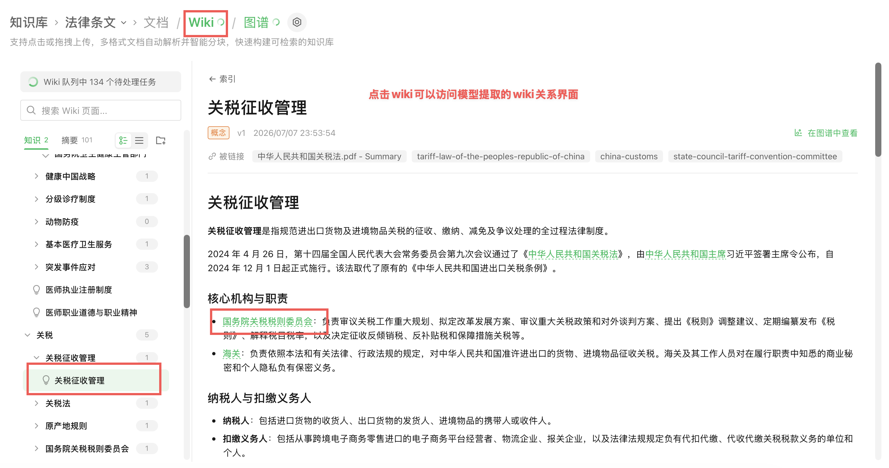

## 6. 向量存储配置

进入「向量存储」，选择 Embedding 模型。Embedding 负责检索召回，直接影响问答能否引用到正确文档。

操作方法：点击 Embedding 模型下拉框，选择管理员预置的默认向量模型。这里配置的是检索模型，不是聊天模型；上传文档后，系统会用它把文档分块写入向量索引。

使用建议：

- 优先使用管理员预置的默认 Embedding 模型。
- 不要把 Embedding 模型和聊天模型混用。
- 如果对话提示「加载模型列表失败」或检索不到文档，先检查这里是否有可用模型。

## 7. 解析配置

「解析引擎」「分块设置」「图像处理」「音频处理」决定文档如何入库。

操作方法：普通文本 PDF、DOCX、TXT 保持默认解析引擎和分块设置即可；需要调整分块时，优先改分块大小和重叠长度，不要同时改多项。上传前确认图像处理和知识图谱是否需要开启，避免任务排队混乱。

常用配置：

- 文档解析：负责提取文字内容。
- 分块设置：控制文档切分粒度，普通问答保持默认即可。
- 图像处理：扫描件、图片 PDF 需要开启多模态识别。
- 音频处理：只有上传音频资料时才需要配置。

如果 PDF 是扫描件，必须开启「图像处理」里的多模态功能，否则系统可能只能看到空白或乱码文本。

图像处理页打开「多模态功能」后，需要选择 VLM 视觉模型。系统通常会提供默认 VLM 模型，直接选择带「默认」或「内置」标识的模型即可。该设置只影响图片、扫描件和无法直接抽取文字的 PDF，不会替代普通文字解析。

## 8. Ollama 配置

如果管理员部署了 Ollama 备用模型，可以在「Ollama 配置」里查看服务地址和可下载模型。

操作方法：普通用户一般不需要手动修改这里。只有管理员要求下载备用模型时，才在「下载新模型」里输入模型名称并点击下载。模型是否常驻、是否使用 GPU，由管理员按 [部署模板说明](deploy-template/README.md) 和 [并发配置说明](deploy-template/CONCURRENCY.md) 配置。

## 9. 上传和管理文档

进入某个知识库后，切到「文档」页，可以上传文件、搜索、按标签/类型/状态筛选。

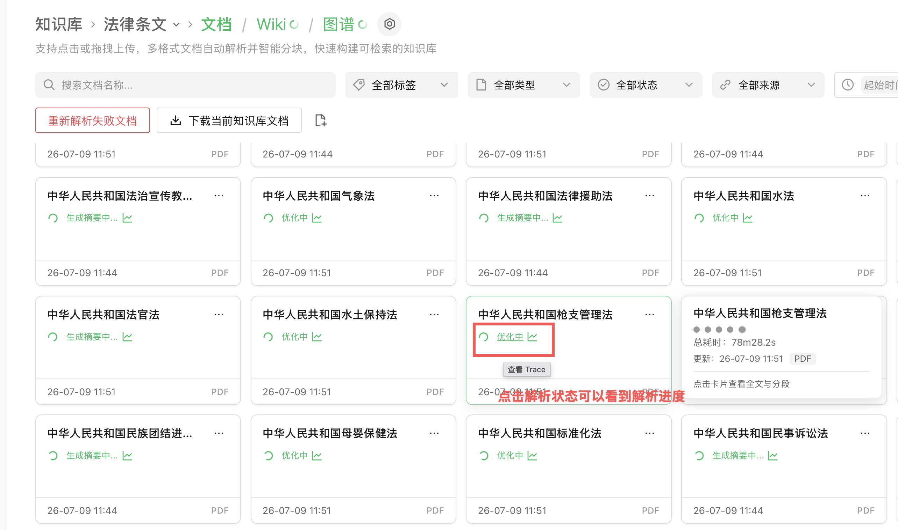

操作方法：点击上传按钮或拖拽文件到页面上传；用搜索框按文件名过滤；用「全部标签」「全部类型」「全部状态」「全部来源」缩小范围。文件上传后先进入文字解析，再进入摘要、Wiki、图谱等后处理。

文档卡片状态说明：

- 文档解析中：正在提取文字、切分、向量化。
- 生成摘要中 / 优化中：文字已入库，正在进行摘要、Wiki、图谱等后处理。
- 解析失败：任务停止，需要重新解析。
- 已完成：当前启用的解析能力已完成。

## 10. 文档管理、重析和 Trace

文档卡片右上角菜单是单个文档的操作入口，可以查看 Trace、重建知识、停止解析、移动、批量管理或删除文档。Trace 用于查看这个文档每个处理阶段是否成功，重建知识用于按当前知识库配置重新解析该文档。

文档页顶部提供「重新解析失败文档」按钮，用于把当前知识库中明确失败且已停止的文档，按知识库当前默认配置重新入队；「下载当前知识库文档」用于一次性下载当前知识库内的源文件。

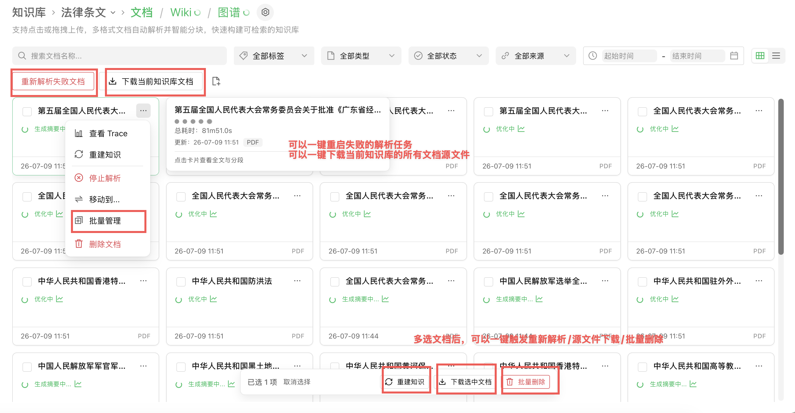

单个文档点击「重建知识」后，会打开重新解析确认窗口。这里会沿用该文档上次解析时的配置，也可以只针对这一次重析单独调整：

- 解析引擎和分块：控制这份文档如何重新提取文字、切分和入库。
- 多模态：控制这份文档本次是否重新触发图片、扫描件识别；关闭后，本次重析不会跑图片解析。
- 图谱：控制这份文档本次是否重新触发实体关系抽取；关闭后，本次重析不会跑知识图谱。
- 问题生成：控制是否重新生成推荐问题。

确认后，系统会按弹窗里的配置重跑这一个文档；这些配置会保存到该文档，后续再次重析时默认沿用。

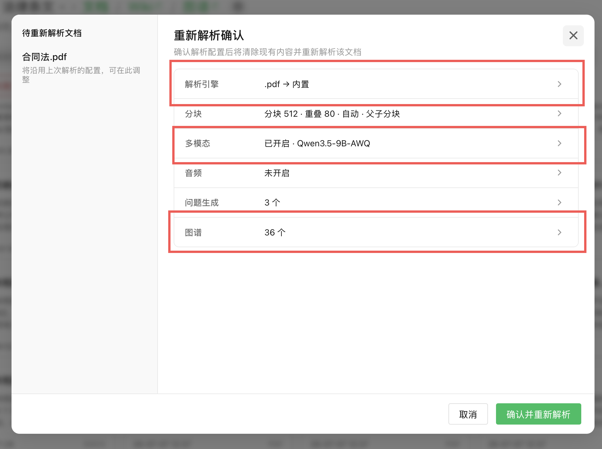

选中文档后，底部会出现批量操作栏：

- 重建知识：重新解析选中文档。
- 下载选中文档：下载选中文档的源文件。
- 批量删除：删除选中文档。

点击「查看 Trace」后，可以看到文档处理流水线，用于判断失败发生在哪个阶段。

操作方法：在文档卡片右上角菜单点击「查看 Trace」，展开失败或耗时较长的阶段。红色节点表示失败，橙色或长条通常表示仍在运行或耗时较久；如果失败发生在 Wiki、Graph 或多模态阶段，文字检索可能已经可用。

常见阶段：

- 文档解析：提取原始文字。
- 分块：切分成可检索片段。
- 向量化：生成 Embedding。
- 多模态识别：识别扫描件或图片内容。
- postprocess.question：生成问题。
- postprocess.wiki：生成 Wiki。
- postprocess.graph：生成知识图谱。

如果只有 Wiki、Graph 或多模态失败，问答可能仍可使用已经完成的文字内容。

## 11. 快速问答

回到对话页面，选择知识库后提问。底部模型选择器应使用管理员配置好的默认模型；普通用户无需每次手动切换。

操作方法：在输入框上方选择要使用的知识库或文件范围，确认右下角模型为默认模型，然后输入问题发送。提问时尽量写清具体主题、条款、章节或文件范围，系统会先检索文档，再组织回答。

如果回答前显示「正在理解问题」或「检索知识库」，表示系统正在做检索、Embedding 或引用准备，不是模型思考内容。

## 12. 微信 / IM 访问知识库

管理员可以在通用设置里添加 IM 集成，让用户通过企业微信、飞书、Slack、Telegram、钉钉、Mattermost、微信或 QQBot 等 IM 应用访问知识库。

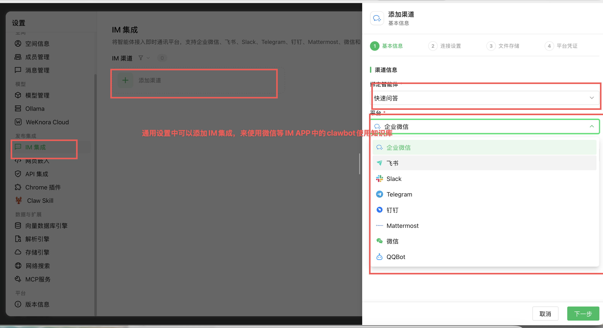

操作方法：

1. 进入系统设置。
2. 在左侧选择「IM 集成」。
3. 点击「添加渠道」。
4. 在「绑定智能体」里选择要开放给 IM 使用的智能体，例如「快速问答」。
5. 在「平台」里选择企业微信、飞书、微信等具体渠道。
6. 继续完成连接设置、文件存储、平台凭证配置。
7. 保存后，用户即可在对应 IM 应用中通过机器人访问绑定的知识库。

IM 集成是让外部聊天工具访问知识库，不影响知识库的文档解析、图像处理、Wiki 或知识图谱配置。

## 13. 查看引用来源

回答完成后，正文上方会显示「检索完成 · 引用了 N 篇文档」。点击该区域可展开引用来源。

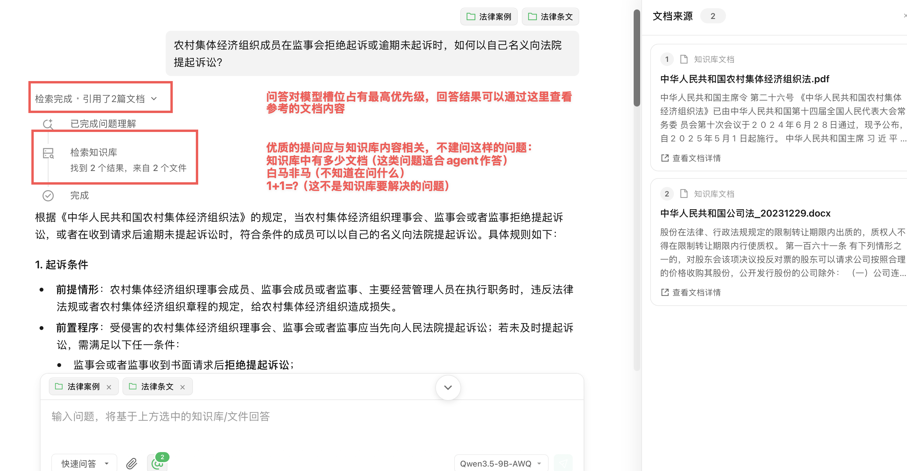

操作方法：点击「检索完成 · 引用了 N 篇文档」展开右侧「文档来源」面板，再点击具体来源查看命中的原文片段。若看到乱码或内容明显不对，通常是原文档文字层异常或扫描件没有完成多模态识别，需要回到文档页查看 Trace 并重新解析。

## 14. 配置建议

按资料类型选择功能。默认先保证文字解析、向量化和检索可用；Wiki、知识图谱属于增强能力，只有确实需要跨文档关系、实体关系或长期知识沉淀时再开启。

| 资料类型 | 默认是否开启 Wiki / 知识图谱 | 推荐索引策略 | 可不开启的典型情况 | 建议开启的典型情况 |
| --- | --- | --- | --- | --- |
| 产品文档 / 使用手册 | 可开启 Wiki，图谱按需 | Vector Search + Keyword Search / BM25 + Wiki | 只做快速问答、按章节查原文 | 需要主题页、术语页、功能之间的长期关联 |
| 项目资料 / 会议记录 | 多数先不开启 | Vector Search + Keyword Search / BM25 + 标签 | 单项目资料少、只查会议结论和负责人 | 多项目、多角色、多任务关系，需要追踪「人-事项-时间-决策」 |
| 研发文档 / API 文档 | Wiki 可开启，图谱按需 | Vector Search + Keyword Search / BM25 | 只查接口说明、配置项和错误码 | 需要模块关系、依赖关系、组件调用关系 |
| 合规 / 制度 / 流程文档 | 建议开启 Wiki，图谱按需 | Vector Search + Keyword Search / BM25 + Wiki | 只查单条制度原文 | 需要跨制度比较、角色职责、流程节点关系 |
| 图片 PDF / 扫描件 | 按需开启多模态 | RAG + 多模态识别 | 文档本身已有可复制文字层 | 扫描件、截图、图片表格较多，普通解析看不到文字 |
| 通用判断规则 | 先不开启，按需开启 | 初期：Vector + Keyword；复杂场景：Vector + Keyword + Wiki + KG | 问题主要是查条款、找依据、引用原文、总结 | 问题需要跨文档关系建模、多跳推理、长期知识沉淀、实体关系追踪 |

扫描件 PDF 还必须开启「图像处理 / 多模态识别」，否则系统可能无法抽取有效文字。

并发、模型显存、后台任务优先级由管理员配置。机器资源不足时，不建议普通用户同时开启多模态、Wiki 和图谱解析大量文档；具体资源判断见 [CONCURRENCY.md](deploy-template/CONCURRENCY.md)。

## 15. 系统资源与任务队列

此部分仅供管理员使用。进入「系统设置」可查看后台任务池配置；修改带「需重启」标识的 worker 参数后，必须重启 app 才会重建任务池。部署侧 env、模型服务容量和完整参数说明见 [并发配置说明](deploy-template/CONCURRENCY.md)。

六个 worker 池分别负责：核心解析（文档解析、分块、向量化）、后处理编排、内容富化（摘要、多模态、图谱、问题生成）、维护与同步、共享弹性，以及 Wiki。它们控制可同时领取的后台任务数，不等于模型并发。所有 worker 池都要求正整数；设置为 `0` 或负数不会关闭该池，而是回退到代码默认值。小机器从所有池 `1` 开始，优先保证核心解析和聊天问答。

「任务队列」页面用于确认任务实际是否运行、排队或失败：

- 运行中 / 排队中 / 重试中 / 死信：分别表示正在执行、等待 worker、等待重试和超过重试次数的任务。死信增长时应查看 Trace 或 app 日志，而不只是提高并发。
- Worker 池的「运行中/容量」表示任务池占用。例如 `2/2` 表示两个 worker 都在工作；这不表示已有两路请求进入模型。
- 模型并发占用才表示后台请求是否已进入模型服务。若聊天变慢或出现限流等待，优先降低内容富化、Wiki、Graph 或 embedding 并发，确保聊天预留仍有容量。
- 默认（文档解析）队列长期排队时，检查核心解析 worker、docreader、embedding 服务和数据库；图谱或 Wiki 队列排队但聊天和文字检索正常时，可以让增强任务继续低优先级处理。
